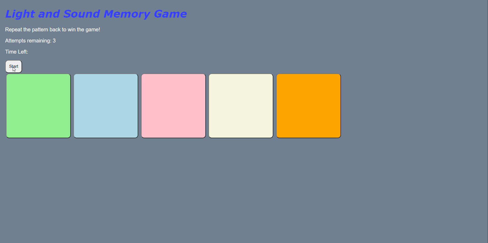

# Pre-work - *Memory Game*

**Memory Game** is a Light & Sound Memory game to apply for CodePath's SITE Program. 

Submitted by: **Frederick Sion**

Time spent: **11** hours spent in total

Link to project: (https://glitch.com/edit/#!/site-program-pre-work--light-and-sound-memory-game?path=README.md%3A7%3A16)

## Required Functionality

The following **required** functionality is complete:

* [x] Game interface has a heading (h1 tag), a line of body text (p tag), and four buttons that match the demo app
* [x] "Start" button toggles between "Start" and "Stop" when clicked. 
* [x] Game buttons each light up and play a sound when clicked. 
* [x] Computer plays back sequence of clues including sound and visual cue for each button
* [x] Play progresses to the next turn (the user gets the next step in the pattern) after a correct guess. 
* [x] User wins the game after guessing a complete pattern
* [x] User loses the game after an(3) incorrect guess(es)

The following **optional** features are implemented:

* [ ] Any HTML page elements (including game buttons) has been styled differently than in the tutorial
* [x] Buttons use a pitch (frequency) other than the ones in the tutorial
* [x] More than 4 functional game buttons
* [x] Playback speeds up on each turn
* [x] Computer picks a different pattern each time the game is played
* [x] Player only loses after 3 mistakes (instead of on the first mistake)
* [x] Game button appearance change goes beyond color (e.g. add an image)
* [ ] Game button sound is more complex than a single tone (e.g. an audio file, a chord, a sequence of multiple tones)
* [x] User has a limited amount of time to enter their guess on each turn

The following **additional** features are implemented:

- [ ] List anything else that you can get done to improve the app!

## Video Walkthrough

Here's a walkthrough of implemented user stories:

## Reflection Questions
1. If you used any outside resources to help complete your submission (websites, books, people, etc) list them here. 
-https://www.w3schools.com/jsref/met_win_setinterval.asp
-stack overflow

2. What was a challenge you encountered in creating this submission (be specific)? How did you overcome it? (recommended 200 - 400 words) 

        The biggest challenge was trying to get the clock to work. I found it to be a tricky task mainly because startInterval was a tricky
        concept for me to grasp at first. The biggest issue for me was finding out where to start the timer. Eventually I decided to put it into the playClueSequence() function
        because it did not interfere with sound here, although it did start during the sequence. By making sure there was enough time in every turn by increasing the timer each         turn, the game became practical to play even with this issue.

3. What questions about web development do you have after completing your submission? (recommended 100 - 300 words) 

        My greatest question would be: "How do web developers maintain large sites, and store the information from the site onto their large databases." I am seriously                 wondering right now on how larger sites like amazon can manage to run a really large server that millions use,without it shutting down constantly, and then store and           retrieve the data amongst millions, that is actually personal to a user.

4. If you had a few more hours to work on this project, what would you spend them doing (for example: refactoring certain functions, adding additional features, etc). Be specific. (recommended 100 - 300 words) 

        If I had a few more hours to work on this project I would definitely be improving the functionality of the timer, as it starts in during the sequence rather than after.         I would also be adding in my own audio, as it takes a lot of time to search for the right royalty free audio to use. Additionally I would be cleaning up my code,               redocumenting, and polishing off the user interface.

## License

    Copyright [Frederick Sion]

    Licensed under the Apache License, Version 2.0 (the "License");
    you may not use this file except in compliance with the License.
    You may obtain a copy of the License at

        http://www.apache.org/licenses/LICENSE-2.0

    Unless required by applicable law or agreed to in writing, software
    distributed under the License is distributed on an "AS IS" BASIS,
    WITHOUT WARRANTIES OR CONDITIONS OF ANY KIND, either express or implied.
    See the License for the specific language governing permissions and
    limitations under the License.
